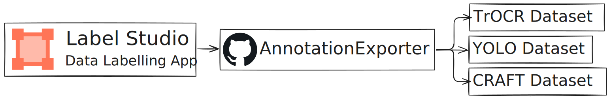

# Label Studio annotation exporter

For labeling text regions and their contents we used [Label Studio](https://labelstud.io/).
AnnotationExport is an CLI script that builds datasets for TrOCR, YOLO and CRAFT out of LS annotations.

<div align="center">
	
</div>

- Images are taken from an S3 bucket
- Annotations from Label Studio can be taken from both s3 and .json file
- Resulting dataset can be saved to both s3 and a local folder

# Installation

1. Create an virtual environment (Optional)

```bash
python -m venv venv
# for windows:
./venv/Scripts/activate.ps1
# for linux:
source ./venv/bin/activate
```

**Either:**

2. Install package from GitHub

```bash
pip install git+https://github.com/DialecticalHTR/AnnotationExporter.git
```

3. Create `.env` in the folder you'll use the app, copy `.env.template` contents into it, add necessary data

**or**

2. Clone repository

```bash
git clone https://github.com/DialecticalHTR/AnnotationExporter.git
```

3. Install as editable package

```bash
pip install -e .
```

4. Rename `env.template` to `.env`, add necessary data

# Usage

Parameters:

- `--from source_type path`: an annotation type to use and the path to data. Source type can be `s3` or `export` (Local Label Studio JSON file). You can supply multiple annotations!
- `--to output_type path`: an output type and path to a place where dataset would be saved. Output type can be `s3` or `folder`. You can have multiple outputs at the same time!
- `--data model_type`: dataset to generate. Dataset type can be `trocr`, `yolo` or `craft`. The default dataset is TrOCR.

Example:

```bash
anno-exporter --from s3 dialectichtr-data --from export 13.json --to folder output --data yolo
```
